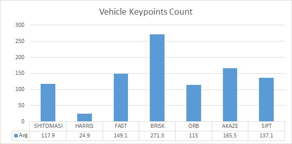
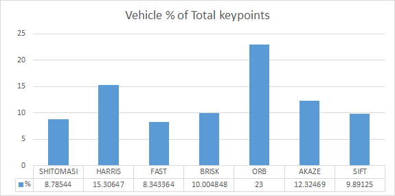
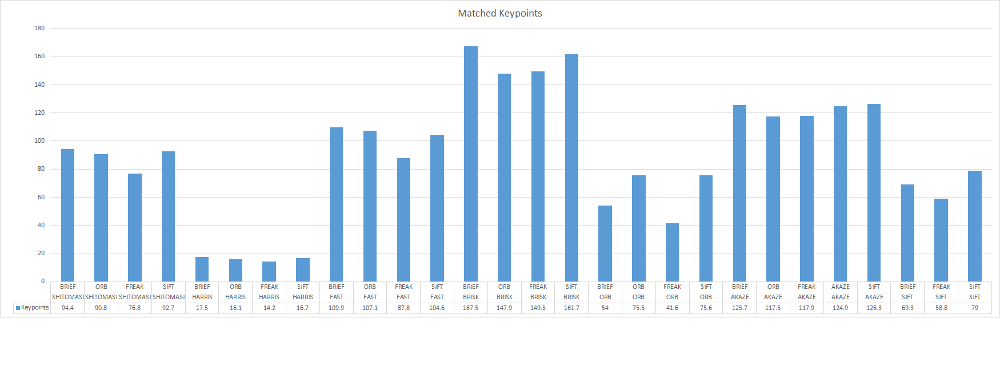
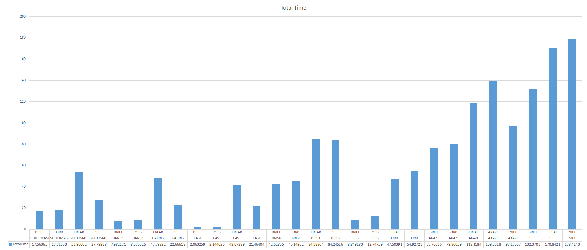

# Camera Based 2D Feature Tracking - Results Summary

## Project Specification

### MP.1 Data Buffer Optimization
To implement the requested ring buffer, a new type "RingBuffer" has been defined in dataStructures.h. This type just inherits from the stl adapted std::queue with std::deque as a container type, while modyfing the push method to first remove the front element then push the new element, when the ring buffer is full.

### MP.2 Keypoint Detection
The following detectors are implemented in the project: "SHITOMASI", "HARRIS", "FAST", "BRISK", "ORB", "AKAZE" and "SIFT". Apart from manual implementation of HARRIS detector, all other detectors are directly called from openCV in the function detKeypointsModern().
 
They detector type can be selected either by setting the detectorType string to one of them, or enabling the evaluation code which tries out all detectors.

### MP.3 Keypoint Removal
To focus on the experimental evaluation of detectors performance, all keypoints outside the region of interest, which is defined as the vehicle ahead, were manually removed. 

This was implemented by manually defining a ROI rectangle and making use of the functions cv::Rect::contains to check if the defined rectangle contains the point under test, along with std::remove_if to remove the keypoint from the vector if it does not fall within the defined rectangle.

### MP.4 Keypoint Descriptors
The following descriptors are implemented in the project: "BRIEF", "ORB", "FREAK", "AKAZE" and "SIFT". All of them are directly called from openCV in the function descKeypoints().

They descriptor type can be selected either by setting the descriptor string to one of them, or enabling the evaluation code which tries out all descriptors.

### MP.5 Descriptor Matching
In addition to the provided Brute-Force implementation, FLANN matching was added to the function matchDescriptors(). The matching type can be selected by setting the matcherType string to one of them.

### MP.6 Descriptor Distance Ratio
Descriptor distance ratio test was added to the function matchDescriptors() by using K-Nearest-Neighbor matching (with k=2). The minimum descriptors distance ratio is set to 0.8.

### Performance Evaluation
For the purpose of performance evaluation, all values of interest were dumpted to a csv file: [results.csv](results.csv). Afterwards, an analysis was made using excel in [results.xlsx](results.xlsx).

### MP.7 Performance Evaluation 1
The number of keypoints on the preceding vehicle was calculated for all images for all detectors types and logged to the csv file. To compare between the different detectors, the average number of detected keypoints were plotted as shown below:

Also, the percentage of vehicle keypoints from the total detected keypoints prior to filtering, was also compared:

BRISK detector reports most number of keypoints on average "271.3". While ORB has most keypoints % on vehicle, but less number of average vehicle points "115".

### MP.7 Performance Evaluation 2
To compare between the matched keypoints for all possible detectors and descriptors combinations,  Brute-Force matching is used with the descriptor distance ratio set to 0.8.

The number of matched keypoints across the 10 images is plotted for all combinations as shown below:

BRISK detector with BRIEF descriptor matches the most number of keypoints on average "167.5".

### MP.7 Performance Evaluation 3
To compare the runtime performance for all possible detectors and descriptors combinations, the times for each part was logged and the total time is computed and plotted as shown below:

Based on runtime performance criteria, the following top 3 combinations are recommended

| Detector | Descriptor | Time [ms]
| -------- | ---------- | ---------
| FAST     | BRIEF      | 2.06
| FAST     | ORB        | 2.14
| ORB      | BRIEF      | 8.85